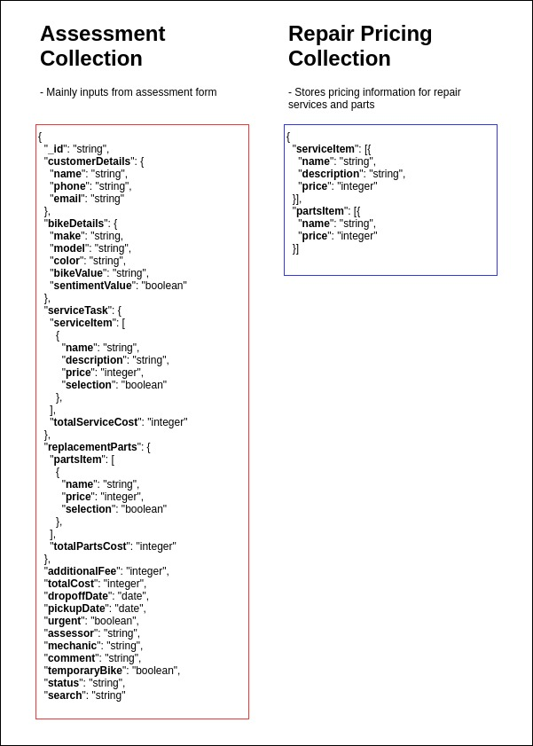
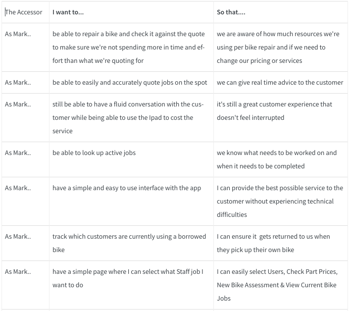
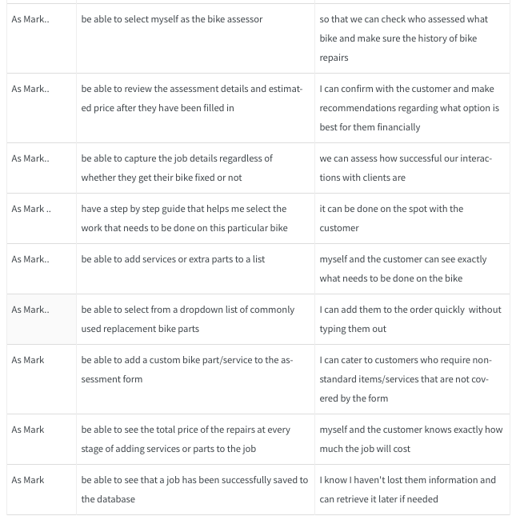
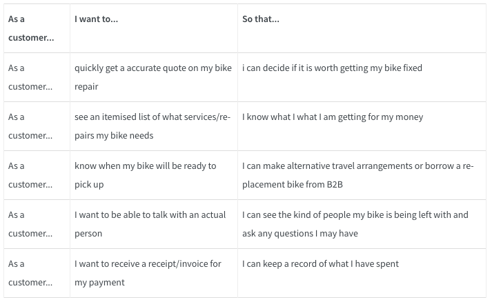
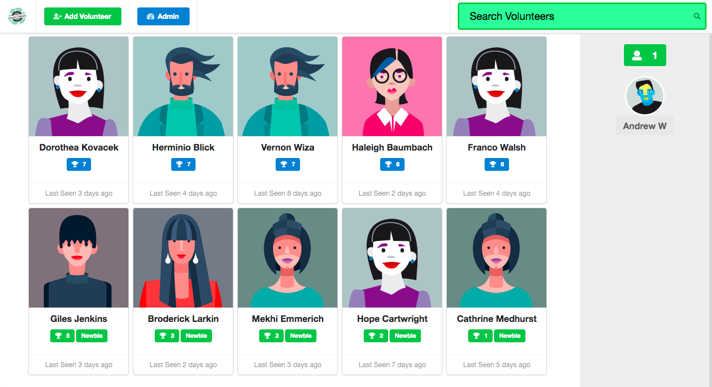
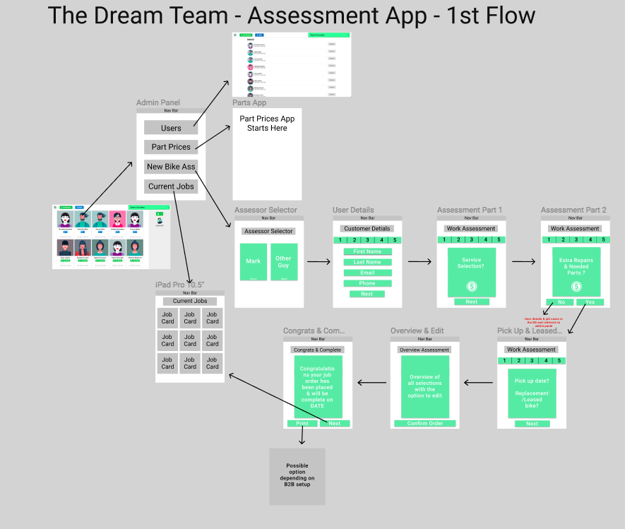
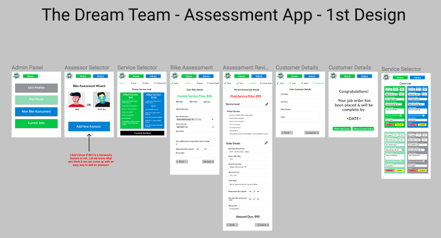

# DREAM TEAM README

# Back To Bikes Assessment App

## - Turning Paper Into Tech

[Link to the GitHub repository](https://github.com/Back2bikes/attendance)

---

# Contents
- **[Who is your client?](#1)**
- **[What is your client’s need (i.e. challenge) that you will be addressing in your project?](#2)**
- **[Describe the client’s current setup and data.](#3)**
- **[Describe the project you will be conducting and how your App will address the client’s needs.](#4)**
- **[Identify and describe the software (including databases) to be used in yourApp.](#5)**
- **[Identify and describe the network setup you will use in your development.](#51)**
- **[Identify and describe the infrastructure (i.e. hardware) that your App will run on.](#52)**
- **[Describe the architecture of your App.](#6)**
- **[Explain the different high-level components (abstractions) in your App.](#7)**
- **[Detail any third party services that your App will use.](#71)**
- **[Identify the database to be used in your app and provide a justification for your choice.](#8)**
- **[Discuss the database relations to be implemented.](#9)**
- **[Provide your database schema design.](#10)**
- **[Provide User stories for your App.](#11)**
- **[Provide Wireframes for your App.](#12)**
- **[Describe the way Tasks are being allocated and tracked in your project.](#13)**
- **[Discuss how Agile methodology is being implemented in your App.](#14)**
- **[Provide an overview and description of your Source control process.](#141)**
- **[Provide an overview and description of your Testing process](#15)**
- **[Discuss and analyse requirements related to information system security](#151)**
- **[Discuss methods you will use to protect information and data.](#16)**
- **[Research what your legal obligations are in relation to handling user data.](#17)**

## Who is your client?
**[Home](#contents)** 

Our client is a non-profit organisation that is filling a need for bike training and recycling where there are currently very few offerings. Bicycle usage is increasing dramatically, more people are using them for daily transport, and the government is investing money in bike infrastructure. Port Phillip’s Department of Sustainable Transport is a strong supporter of Back2Bikes.

Back2Bikes's charges for services, but at a level below for profit bike shops and provides free bikes to other charitable organisations, and bikes/servicing at further reduced pricing to healthcare card holders.

Back2Bikes’s mission is to provide bike training services, and bike recycling for the local community. It takes the form of a social enterprise, and does the following:

- Provides training for volunteers

- Provides training courses in bike maintenance

- Accepts bike donations for recycling

- Provides affordable bike servicing

- Recycles bikes as affordable transport

- Provides bikes for people with special needs

- Provides bikes for needy people

---

## What is your client’s need (i.e. challenge) that you will be addressing in your project?
**[Home](#contents)** 

- Back2Bikes's current method for evaluating customers' bikes for repair or recycling is through a paper form that is stored physically. This requires physical storage and the information on it is difficult to access to find replacement parts. It takes staff time to add up individual prices for replacements parts. Job tracking is difficult.

- We need to do a thorough assessment of the bike when the customer brings it in.

- By doing this, we can accurately determine what needs to be done, and how much it will cost.

- Often the cost of repairs is more than the bike is worth. Knowing the cost ahead of time allows us to have a conversation with the customer about a go/no-go decision while they are still on the premises.

---
## Describe the client’s current setup and data.
**[Home](#contents)** 

- Client's current setup is to use a paper form for bike repair assessment
- The paper form is recycled once a job is complete.
- The data collected on the paper form is not kept or stored anywhere once a job is completed and they cannot review previous jobs they may have completed.
- The price for a bike repair/service is estimated by the assessor (added on the one of 2 base prices, $60 for minor service and $120 for major service)

---

## Describe the project you will be conducting and how your App will address the client’s needs.
**[Home](#contents)**

- A wizard which leads you through recording what needs to be done on the bike.
- A simple checklist guides you to check each part of the bike, and you tick a box to say what needs to be fixed (eg replace/service/nothing)
- It keeps track of the cost as you go, and once it gets to a certain price it may warn that the cost is getting high (might be useful to nter the value of the bike up front)
- At the end it provides a review of the items to be fixed, and allows the list to be edited (if some items are not to be fixed).

---
## Identify and describe the software (including databases) to be used in yourApp.
**[Home](#contents)**

We will use the software below for our app:

- React
- Javascript
- Semantic UI
- MongoDB
- Meteor
- Trello
- Git
- Storybook
- Storyshots
- Circle Continuous Integration
- Nuclino

Some of the software we have never used before but it's what the client is using and we need to learn and adapt to their needs & deliver a valuable solution.

---
## Identify and describe the network setup you will use in your development.
**[Home](#contents)**

Our network setup for this particular is as follows: 

The front end is in React JS, a component orientated JS framework which connects to the backend via http requests.

The backend is written in Meteor which connects to a MongoDB Atlas Cloud Database and is deployed using Meteor Up, Docker and a AWS Server.

All data is served using JSON to keep things consistent, efficient and modern.

---
## Identify and describe the infrastructure (i.e. hardware) that your App will run on.
**[Home](#contents)**

Our application will be cross-platform running on laptops, tablets, and mobile phones. As our app will be exclusively used in a workshop so it was important that it be able to run on many different devices.

Our hosting and database is with 3rd party providers (Digital Ocean, MongoDB) that have hardware infrastructure spread around the globe.

---

## Describe the architecture of your App.
**[Home](#contents)**

The architecture of our app consists of:

- Full-stack: Meteor
- - Front-end: React
- - Back-end: Meteor
- Database: MongoDB
- Hosting: Digital Ocean

Our client Back2Bikes had already developed an app prior to our arrival, so our architecture choice had already been decided. Luckily, the stack they are using is one we are mostly familiar with (with the only exception being the Meteor Framework). Our apps backend is running on Meteor with a MongoDB database. It is using React on the front end with the Semantic UI library used for our styles. This is inline with the client's existing setup for both development and design purposes.

---
## Explain the different high-level components (abstractions) in your App.
**[Home](#contents)**

Our app consists of 8 high-level components. They are:

- Display-user component
- Admin Panel component
- Service Selector Component
- Bike assessment component
- Bike assessment review component
- Customer details component
- Confirmation component
- Current bike jobs component

From these higher level components there will be many sub components that make up each individual feature. 

---

## Detail any third party services that your App will use.
**[Home](#contents)**
## 

Almost the entirety of our application is build from 3rd party services. All languages, frameworks and tools and sourced from a 3rd party. However, there are a few that stand out from the rest. They are: 

- Digital Ocean - A hosting provider for us to deploy our application

- MongoDB Atlas - A cloud database for our application

As well as the above to services we will also be using 

- React JS 
- React Router
- Meteor
- Meteor Up 
- Bcrypt
- Simpl-schema
- Storybook
- Jest
- Mocha 
- React-JSONschema-Form-Semanticui

---
## Identify the database to be used in your app and provide a justification for your choice.
**[Home](#contents)**

As we are using Meteor for our project, MongoDB is the default database we will be using. This suits our needs because MongoDB is:

- Moves when you scale - modern db 

- Is very easy for rapid development 

- Additional collections & documents can be added without heavy mapping in advance

- The structure is a single object which is very clear for on-boarding team members.

- There are no complex joins

- Deep query-ability. MongoDB supports dynamic queries on documents using a document-based query language that's nearly as powerful as SQL.

- Document Oriented Storage − Data is stored in the form of JSON style documents.

- Index on any attribute

- Replication and high availability

- Auto-sharding

- Fast in-place updates

- Professional support by MongoDB is very good

---
## Discuss the database relations to be implemented.
**[Home](#contents)**

MongoDB is not a relational database,  so we will not be using database relations.

For this specific app we will only have one relationship between collections. It will be between the assessment & repair-pricing collections. This enables us to have a collection of parts & pricing that will populate the assessment collection on a query if need be. 

One of the great things about MongoDB is it is very easy to enable a relationship and populate the data on a specific query. This enables fast dynamic development over drawn-out planning sessions.

---
## Provide your database schema design.
**[Home](#contents)**

Database Type: No-SQL Database  
Database Engine: In-built MongoDB in Meteor  
Database Server: TBC

## Schema
The database will consists of 2 collections:

 - "assessment" - it will store all the information for bike assessment
 - "repair-pricing" - it will store all the pricing information of the repair services and parts

See below the database schema that we mocked up using JSON:

****

---
## Provide User stories for your App.
**[Home](#contents)**

Our user stories are spilt into two parts.

- The assessors needs 
- The customers needs 

---

## Provide Wireframes for your App.
**[Home](#contents)**

Coming into a pre existing codebase for the non for profit Back To Bikes we had to addapt to their stack as well as their current designs. We made sure that all the components we designed would be large, as many members of staff at Back2Bikes are older and don't have the best vision.

This is the initial style of the attendance app that we had to align with

We created a basic Figma user flow to give to our client for review. Shown below: 

After feedback from our client, we created the first design. Shown below:

After another round of feedback, we created our client confirmed design. Shown below:

---

## Describe the way Tasks are being allocated and tracked in your project.
**[Home](#contents)**

Before anything else, our team got together and decided on the outcomes as well as the standards that we wanted to live by. This will help us keep on track and keep each other accountable. 

Here is our team outcome and standards: 
## Team Outcome

- Deliver a valuable MVP and learn as much as possible

- Richard - Wanting to sharpen up on databases design, access & React.

- Jess - Wanting to hone her CSS & design skills

- Chris - Wanting to focus on React & Meteor

- AJ - Wanting to focus on React, Redux & Meteor

## Team Standards

- Arrive and be ready for a 10am standup

- Lunch is from 1pm - 2pm

- Finish at 5pm ... for now 

- Each Friday we pick a new task or already have one & we get done what we get done over the weekend

 - Over communicate! 

 - No pull requests or Gitting on weekend

The tasks are being allocated and tracked on a Agile style Trello board after the breakdown of the clients needs. The board is broken down into an agile workflow structure as follows:

Backlog

- These are items that need to be done, but perhaps they depend on something likeIt depends on another card being completed first You have not worked out the details of how to do it

- It's not in the current sprint, or it's not a high priority

Ready

- These are items that are ready to go, and have details filled in on the card. Create a checklist of the things that you need to do. (This card has an example of a checklist)Cards here won't usually won't have a name on them yet

In progress

- When you start a task, move the card into "In Progress" and put your name on it. It's best to only have one card each in this list - make it a habit to complete a task before grabbing another one

Dev done

- When you have completed work on the task, create a pull request, update the changelog, and move it to "Dev Done".

- Someone other than the dev should review the Pull Request for code quality, ask for changes if needed, and finally approve and merge it

- When the PR is merged, it will be moved into QA for someone to test it.

QA (Quality Assurance)

- All items should be tested in the staging environment by someone other than the person who did the work. Someone else will test it differently, and that perspective is useful.

Done

- We move cards to done after it has been through all of the steps above. There are some exceptions, but all development cards will need to go through the process.

- The tasks are allocated based on our teams strengths, eagerness to take on certain tasks , and allowing team members to learn the most from each other and this project as possible.

- The Development  tasks will be broken down in Sprint planning to ensure we have enough time to complete the different parts of the project.

---

## Discuss how Agile methodology is being implemented in your App.
**[Home](#contents)**

- Daily standups are being used to check in with everyone each day and help resolve the teams blockers.

- Sprints - We are working on a one week sprint cycle. This allows us to prioritise our most important work in earlier sprints and leave the stretch goals for later sprints.

- Retrospectives - After each sprint we have a short retrospective to look at what went right and what went wrong so we are able to adjust our behaviour for future sprints and ideally improve productivity.

- Trello  is being used as our Kanban board to pass tickets back and forth through various points of the development cycle. A team member is assigned a ticket and it is their responsibility to see it through to completion (with the assistance of other team members as required.)

---

## Provide an overview and description of your Source control process.
**[Home](#contents)**

For source control we will be using git through github.com. 

As we are coming on to an existing project, we are working off a development branch that has been split from the the main project. In the development branch , each of the members of  our team will create their own branch in which to develop the piece of work they have been assigned. After completion and review of the team members work, they will then push their branch up into github. Once in github the code will be reviewed by the project managers and merged into the development branch via an accepted pull request. 

Each new day we will 'git pull' off the master "development" branch so that we are always working off an up to date code base. 

---
## Provide an overview and description of your Testing process
**[Home](#contents)**

- Jest & Mocha will be used as our  testing software for this project.

- Test Driven Development (TDD) is essential and we will be adhering to this standard for our project.

- Testing will be done manually

- While we project that the amount of code in our project  will not be too onerous, we are following the TDD methodology so that we embed good practices in our team members from the get-go.

- We will be writing tests first to ensure that we know what we are aiming for before we begin development.  We will run the tests frequently during the development process.

- Storybook and Storyshots will also be used to test out the appearance and function of different components during the development process.

---
## Discuss and analyse requirements related to information system security
**[Home](#contents)**

In any application where you are gathering user information it is important to make sure that data is accurate, safely stored, and accessible only to authorised users.

At a minimum our customers expect that we:

- Do not use their data for any purpose other than the reason they provided it (to allow us to link their bike repair to them).

- That customer data is safely stored and cannot be accessed by non-related parties to Back2Bikes that may have detrimental reasons for wanting the data.

- That customer data can only be accessed by Back2Bike users that have the appropriate permissions within the app.

---
## Discuss methods you will use to protect information and data.
**[Home](#contents)**

Our approach to user information security fall under these 3 categories

Authentication

- In order to ensure the user's who are on our app are who we expect them to be, we have implemented user pins and passwords to login with your account.

Authorisation

- User's on our app are assigned different roles depending upon their status within the organisation. Only users with managerial roles are able to access customer details, volunteer information, and other sensitive data.

Validation

- All routes are protect using Jason Web Tokens that are 64bit encrypted and salted 

Passwords

- All passwords will be hashed before being saving into the database so there is never a plain text password available to be taken.

---
## Research what your legal obligations are in relation to handling user data.
**[Home](#contents)**

We investigated our legal obligations towards our customer using Google, and came across this page posted by the Australian Government. (https://www.oaic.gov.au/agencies-and-organisations/guides/guide-to-securing-personal-information)

In this link we found that while it is extremely important to protect customer data, the effort made to protect data should be tempered by the potential harm that can occur from customer data being stolen. As we are only storing data that is publicly available for most people (name & email address), we didn't need to slow down our work process too much in order to secure it. We will be following simple Authentication, Authorisation, and data validation standards for our project.

---
