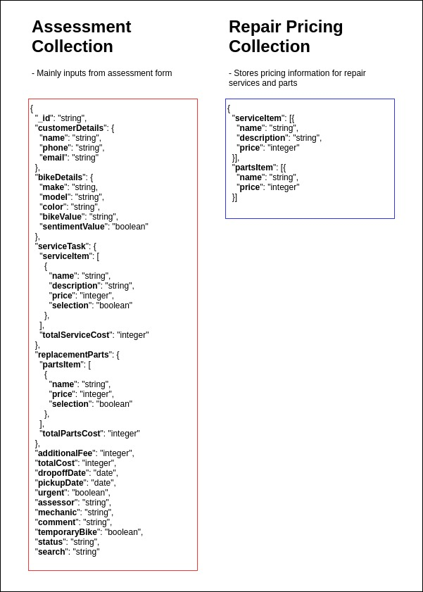

## **Bike Assessment Database Design**

**Database Type**: No-SQL Database\
**Database Engine**: In-built MongoDB in Meteor\
**Database Server**: TBC

### **Schema**

The database will consists of 2 collections:
- "`assessment`" - it will store all the information for bike assessment (Refer to `assessment.json`)
- "`repair-pricing`" - it will store all the pricing information of the repair services and parts (Refer to `repair-pricing.json`)

See below for database schema:

See [link](https://www.draw.io/?lightbox=1&highlight=0000ff&edit=_blank&layers=1&nav=1&title=Bike-Assessment-Schema#R7Vrfk6I4EP5rfNwqBMeZexx13buHrdo6t%2B4eryI0kDK%2FLgmj3l9%2FCQSVYdwCQWVqhgcNTdL56P7SaTuOgjndfZNIpN95BGTke9FuFCxGvj8ePwXmy0r2heTR8wtBInHkOh0FK%2FwfOKHnpBmOQFU6as6JxqIqDDljEOqKDEnJt9VuMSfVWQVKoCZYhYjUpX%2FjSKeF9OnBO8p%2FB5yk5cxjzz1Zo3CTSJ4xN9%2FID%2BL8Kh5TVOpy%2FVWKIr49EQVfR8Fccq6LFt3NgVjblmYrxi3PPD3glsB0kwHOTy%2BIZO7VR4%2BzkT8lZvRsLU0rsS3zjagwDbZWIr83aqf%2FZtw9LLqXvf8x2p3MzLw%2BUVKOCJ4rGpSWmCWnGuddMYSZ0pyCXIBGmKhGeJq%2FeQsgDFG4mTVa4BIpZ4MEBtQ4rCuwJqgeFz3wbI03cHeOUbS50JXXcCAttoPhMSvkhMshArMk%2BisPwQMEp8xWgqn5uADh2mzagNhdVqYC%2BYJD%2BInU5n4r04H4QwNtBOKhC4i6HXvV9q62vW7oTfIZSiw05uz9voSQhnnt4GOmIQE5DPwKiMntW7vgwpjTcEW1iUw10UOn0ectpblGZFWEmjlXurPTbxakJQiCQrDbyw8k9R1zKGGn%2F4zTnyHuM8QNNsTlIeJ9BTgURdg6GJEl3JCpvzRjLxbsDCWSXPA4XiDd0i5RMaI%2FJAKHm0wMAEgmE1u36xoLupNWKVDqhr%2BVz5YSIEwRw%2BHdgYSc0tauuQIOk58ILpHcz3Dbks81iKI00lmzpO2aVlGAZJh2hVHHkFfo9b48Fcjr%2BmAr5555vE2xhpUw2asRbCWyMFNNibkb2zVEcMJMm0Bslb2A1DhE5NmJNRcFCL4xKbutS9kpguUyMNdhcjsKdmdr%2B%2BPDiQHdfQNOQcu96VIOmLpDhv2r%2B%2B3xSMOfOFl6cpwxfXRC5I5RkoPu41GCabjThLdPFp6ucbJwQTnlQxX1B1K3uG663jB3a5WJ9var8EPR7eb%2BHEKIttdy2U%2BInkwuDNHjPkL0b%2FUQ7SycjksLP%2BepYJH7eMYK9d%2Brx76lMMIvpeiLGfUdYUbsS2MmMlvi8WLJaY79RHfM5ekiO9FRc7Kxt656suokZk82g1mMCXklUoYLdl0Ei4fj3U%2Fr58UX%2FxxjuHFxTPJT%2BhRHERhuzKo8e0WkK%2Bzdk6a8GPfAi1LHL4nxJwiEzUL0fpggkMeaC%2Bmx0lyCZYU4KMLMsgEVmiwzzKcs53M5gB2BWFRYtVI4%2FODUeR1Tbksd%2Fw3qdInRtfDr5Vfdcm%2B4rI916FeN6deNOfXeMObTpL0xze3xjz%2F5s5N%2FVwVf%2Fwc%3D) to database schema diagram.

### **API Spec**

See below link to preview the **Bike Assessment API spec**:\
https://app.swaggerhub.com/apis/ongsterrr/bike-assessment-api/1.0.0