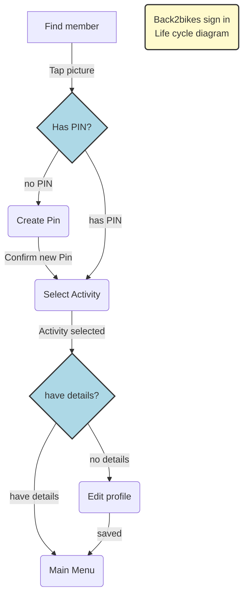

# B2B Login flow

```mermaid
graph TD
classDef green fill:#9f6,stroke:#333,stroke-width:2px
class A green
AA[Find member] -- Tap picture --> HASPIN{Has PIN?}
HASPIN -- no PIN --> CP(Create Pin)
CP -- Confirm new Pin--> SELECT(Select Activity)
SELECT -- Activity selected --> HASDETAILS{have details?}
HASDETAILS -- have details --> RETURN(Main Menu)
HASDETAILS -- no details --> EDIT(Edit profile)
HASPIN -- has PIN --> SELECT
EDIT -- saved --> RETURN
LEGEND(Back2bikes sign in<br>Life cycle diagram)

style LEGEND fill:lemonchiffon,stroke:#333,stroke-width:2px
style HASPIN fill:lightblue,stroke:#333,stroke-width:2px
style HASDETAILS fill:lightblue,stroke:#333,stroke-width:2px
```

<!--stackedit_data:
eyJoaXN0b3J5IjpbMTQwNzgzMjE3LDE0MDc4MzIxNyw2NDM5OT
U0NzMsMjQyMzA1NTM3XX0=
-->