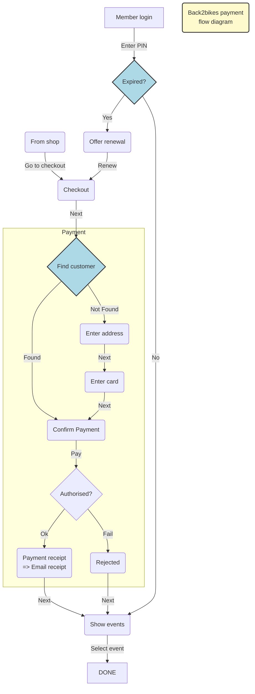

# Payment flow diagram

```mermaid
graph TD
classDef green fill:#9f6,stroke:#333,stroke-width:2px
class A green
AA[Member login] -- Enter PIN --> EXPIRED{Expired?}
LEGEND(Back2bikes payment<br>flow diagram)
  style LEGEND fill:lemonchiffon,stroke:#333,stroke-width:2px
EXPIRED -- Yes --> OFFER(Offer renewal)
SHOP(From shop) -- Go to checkout --> CHECKOUT
EVENTS -- Select event --> DONE
OFFER -- Renew --> CHECKOUT(Checkout)
CHECKOUT -- Next --> FC{Find customer}
subgraph Payment
FC -- Found --> CONFIRM(Confirm Payment)
FC -- Not Found --> ADDRESS(Enter address)
ADDRESS -- Next --> CARD(Enter card)
CARD -- Next --> CONFIRM
CONFIRM -- Pay --> AUTH{Authorised?}
AUTH -- Fail --> FAILED(Rejected)
AUTH -- Ok --> RECEIPT(Payment receipt<br>=> Email receipt)
end
RECEIPT -- Next --> EVENTS
FAILED -- Next --> EVENTS
EXPIRED -- No --> EVENTS(Show events)

    style EXPIRED fill:lightblue,stroke:#333,stroke-width:2px
    style FC fill:lightblue,stroke:#333,stroke-width:2px
```
<!--stackedit_data:
eyJoaXN0b3J5IjpbLTE5NDUxODU2MF19
-->