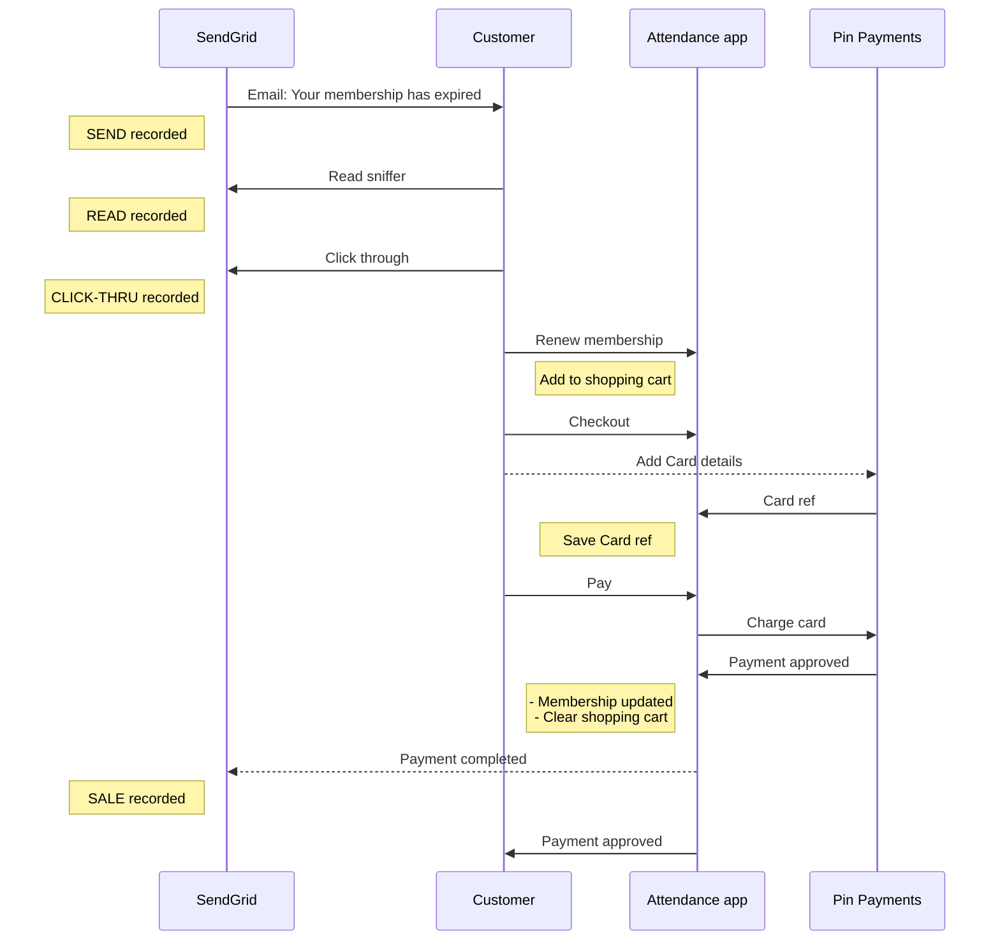

# Email renewal flow
This diagram documents the flow of events between the various systems during the renewal process.

```mermaid
sequenceDiagram
SendGrid ->> Customer: Email: Your membership has expired
Note left of SendGrid: SEND recorded
Customer->>SendGrid: Read sniffer
Note left of SendGrid: READ recorded
Customer->>SendGrid: Click through
Note left of SendGrid: CLICK-THRU recorded
Customer->>Attendance app: Renew membership
Note left of Attendance app: Add to shopping cart
Customer->>Attendance app: Checkout
Customer-->>Pin Payments: Add Card details
Pin Payments->> Attendance app: Card ref
Note left of Attendance app: Save Card ref
Customer->>Attendance app: Pay
Attendance app->>Pin Payments: Charge card
Pin Payments->> Attendance app: Payment approved
Note left of Attendance app: - Membership updated<br> - Clear shopping cart
Attendance app-->>SendGrid: Payment completed
Note left of SendGrid: SALE recorded
Attendance app->>Customer: Payment approved
```
<!--stackedit_data:
eyJoaXN0b3J5IjpbLTE2ODkwNjgyODBdfQ==
-->