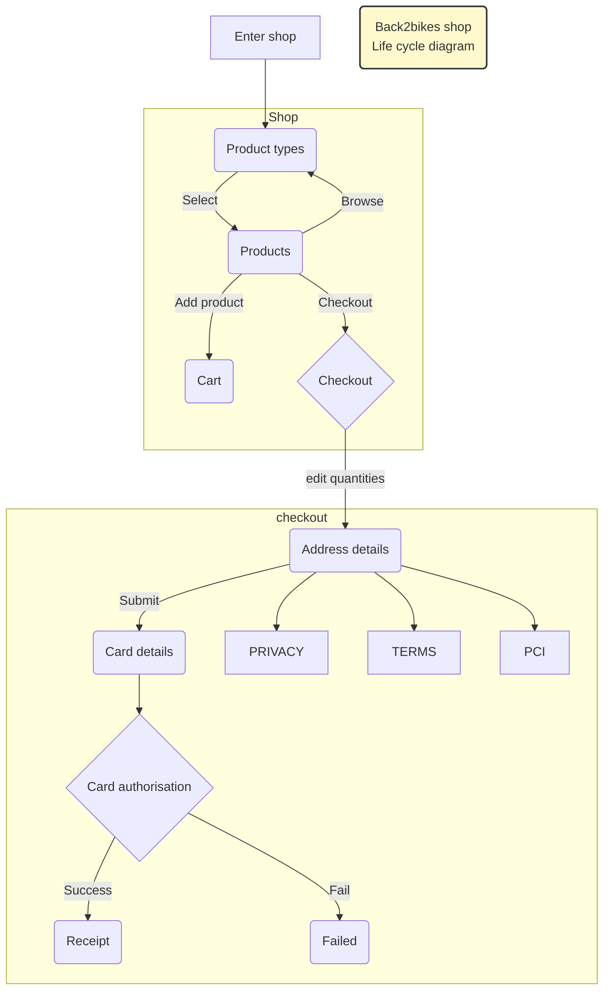

```mermaid
graph TD
AA[Enter shop] --> PRODTYPES(Product types)
subgraph Shop
PRODTYPES -- Select --> PRODUCTS(Products)
PRODUCTS -- Add product --> CART
PRODUCTS -- Checkout --> CHECKOUT{Checkout}
PRODUCTS -- Browse --> PRODTYPES
end

subgraph checkout
CHECKOUT -- edit quantities --> ADDRESS(Address details)
CARD --> AUTH{Card authorisation}
ADDRESS -- Submit --> CARD(Card details)
ADDRESS --> PRIVACY
ADDRESS --> TERMS
ADDRESS --> PCI
AUTH -- Success --> RECEIPT(Receipt)
AUTH -- Fail --> FAIL(Failed)
end

LEGEND(Back2bikes shop<br>Life cycle diagram)
CART(Cart)
style LEGEND fill:lemonchiffon,stroke:#333,stroke-width:2px
```